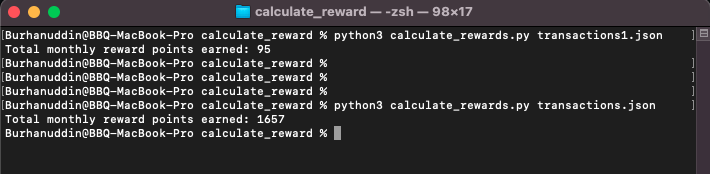

# calculate_reward_points

## Execute the script

**Version**
- python: Python 3.9.5

**Required Python modules**
- import math
- import json
- import sys

Open the Terminal application. Run the following command to execute the python script.

```shell
$ python3 calculate_rewards.py transactions.json
```

## Execute the test

Add test transactions in json format, e.g.: transactions1.json file and pass that file to the python command

**Following is the test results:**



## Solution description

1. Created a dict from the input transactions with the key:merchant_code and the value:amount_cents.
2. Rules are aligned from the most valuable to the least valuable reward points.
3. Rule 7 is used to calculate the spending for all other purchases (including leftover amount)


